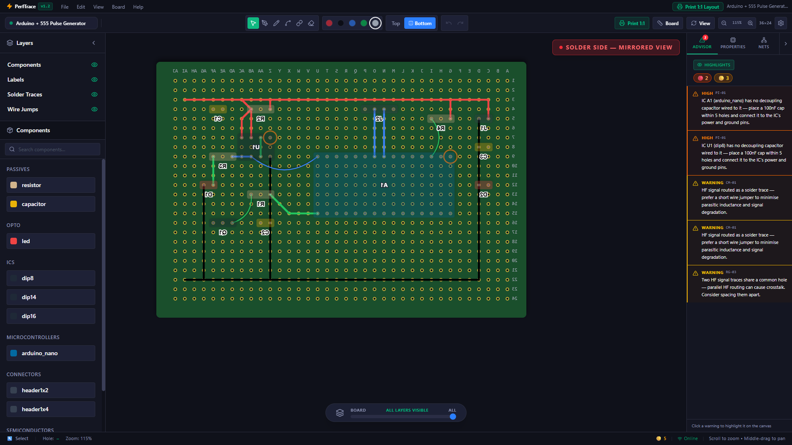
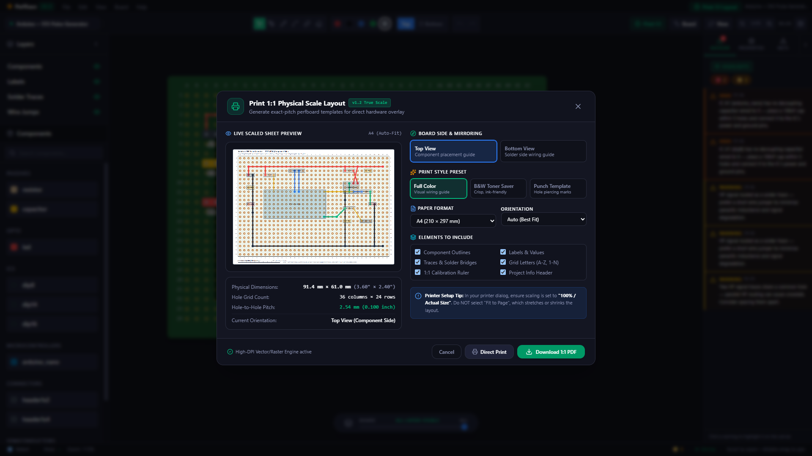

<div align="center">

# ⚡ PerfTrace
### *Next-Generation Perfboard & Stripboard Prototyping CAD*

Design your DIY circuits digitally before you heat up the soldering iron.  
Eliminate wiring mistakes, trace shorts, and inverted pinouts with real-time design rules and 1:1 true-scale physical templates.

[](https://github.com/moon-god23/PerfTrace/releases)
[](LICENSE)
[](https://react.dev/)
[](https://www.typescriptlang.org/)
[](https://vitejs.dev/)
[](https://tailwindcss.com/)
[](https://konvajs.org/)
[](https://developer.mozilla.org/en-US/docs/Web/API/IndexedDB_API)

<br/>


*Real-time circuit design with Arduino Nano, NE555 Timer, color-coded solder traces, arched jumper wires, and active Trace Advisor rule engine.*

</div>

<br/>

---

## 💡 Why PerfTrace?

Breadboards are great for quick bench tests, but translating a rat's-nest of jumper wires onto physical perfboard or stripboard often leads to:
- **Mirroring errors:** Soldering an IC backwards from the bottom side.
- **Short circuits:** Accidental solder bridges between dense power and data pads.
- **Forgotten connections:** Missing bypass capacitors or floating reset lines.
- **Wasted protoboard space:** Realizing too late that your components don't fit.

**PerfTrace solves this.** It gives hardware hobbyists, makers, and embedded engineers a dedicated, lightweight CAD environment that behaves like a physical perfboard—complete with dual-sided X-ray mirroring, real-time DRC (Design Rule Checks), and printable 1:1 scale drilling/wiring guides.

---

## ✨ Key Features

### 🚀 Blazing Fast 60 FPS Canvas
Built on **Konva.js** with hardware-accelerated canvas rendering. Pan, zoom, place components, and route traces smoothly even on large boards with thousands of holes and complex solder nets.

### 🛡️ Live Trace Advisor (Rule Engine)
An intelligent, real-time design rule checker runs silently in the background:
- **PI-01:** Detects missing decoupling capacitors near IC power pins.
- **CM-01:** Identifies high-frequency signals routed as solder traces and recommends low-inductance jumper wires.
- **RG-03:** Flags parallel trace crosstalk and accidental multi-signal pin sharing.
- **Visual Hole Highlights:** Click any warning to immediately illuminate affected pads directly on your board.

### 🔄 Dual-Sided Editing & Mirrored Solder View
Flip between the **Top (Component side)** and **Bottom (Solder side)** with a single keystroke. When viewing the bottom side, the canvas automatically mirrors horizontally and ghosts component footprints, so you see the exact orientation you face when soldering.

<div align="center">
  
  <p><em>Mirrored Solder View: Component footprints become translucent silhouettes while solder tracks pop in vivid high-contrast.</em></p>
</div>

### 🖨️ 1:1 Physical Scale Printing & PDF Export
Print your board at exact physical dimensions (standard **2.54 mm / 0.100″ pitch**) on standard A4 or US Letter paper:
- **Direct Overlay Template:** Place the printed sheet over your blank perfboard to punch guide holes or tape underneath for reference.
- **B&W Toner Saver & Punch Template:** High-contrast modes designed to save printer ink.
- **1:1 Calibration Ruler:** Verify printed scale accuracy with standard calipers or a ruler before soldering.

<div align="center">
  
  <p><em>Print 1:1 Physical Scale Layout modal with live sheet preview, dimensions in mm & inches, and vector PDF download.</em></p>
</div>

### 🎨 Adaptive Modern UI
Choose between high-contrast dark mode or clean daylight light mode featuring glassmorphic controls, collapsible sidebars, and customizable grid dot sizes.

<div align="center">
  
  <p><em>Crisp, high-readability Light Mode.</em></p>
</div>

### 🔒 100% Local-First & Zero Friction
- **No Account Required:** No telemetry, no cloud accounts, and no subscriptions.
- **Auto-Save Resilience:** Every keystroke and trace is continuously auto-saved to your browser's local **IndexedDB**.
- **Portable `.ptrace` Files:** Save and reopen your projects using standard human-readable JSON files.

---

## 📥 Quick Download (No Install Required)

Want to start designing immediately without setting up Node.js or developer tools?

1. Open the [Releases Directory](Releases/) or download the latest [`PerfTrace-v1.2.0.html`](Releases/PerfTrace-v1.2.0.html).
2. Double-click the `.html` file in any modern web browser (Chrome, Edge, Firefox, Brave, Safari).
3. The application is completely self-contained (all scripts, styles, fonts, and icons are inlined) and works **100% offline**.

---

## 🧰 Component Library

PerfTrace ships with footprints for standard through-hole electronic parts:

| Category | Component | Description & Default Footprint |
| :--- | :--- | :--- |
| **Microcontrollers** | `Arduino Nano` | 30-pin DIP breakout (15 × 7 grid units, 0.6″ width) |
| **Integrated Circuits** | `DIP-8` | 8-pin IC (NE555 Timer, Op-Amps, EEPROMs) |
| | `DIP-14` | 14-pin Logic IC (74HC00, 74HC04, 74HC14) |
| | `DIP-16` | 16-pin IC (74HC595 Shift Register, CD4017) |
| **Passives** | `Resistor` | 3-hole horizontal / vertical (Tan body, customizable Ω values) |
| | `Capacitor` | 2-hole ceramic disk or electrolytic |
| **Optoelectronics** | `LED` | 2-hole indicator (Red, Green, Blue, Yellow) |
| **Semiconductors** | `TO-92` | 3-pin transistor footprint (2N2222, 2N3904, DS18B20) |
| | `TO-220` | Power transistor / voltage regulator (LM7805, IRLZ44N) |
| **Connectors** | `Header 1×2` | 2-pin screw terminal or pin header (Power / Battery) |
| | `Header 1×4` | 4-pin interface header (I2C, SPI, UART) |

---

## ⌨️ Keyboard Shortcuts

Speed up your workflow with intuitive keyboard shortcuts:

| Shortcut | Action | Description |
| :---: | :--- | :--- |
| <kbd>1</kbd> | **Select Tool** | Move and inspect placed components and traces |
| <kbd>2</kbd> | **Pen Tool** | Draw solder traces between holes |
| <kbd>3</kbd> | **Wire Jumper** | Draw arched jumper wires across the top layer |
| <kbd>4</kbd> | **Solder Bridge** | Short adjacent solder pads together |
| <kbd>5</kbd> | **Eraser** | Delete traces and connections |
| <kbd>Space</kbd> | **Flip Side** | Toggle between Top (Components) and Bottom (Solder) view |
| <kbd>Ctrl</kbd> + <kbd>S</kbd> | **Save Project** | Save circuit to local `.ptrace` file |
| <kbd>Ctrl</kbd> + <kbd>O</kbd> | **Open Project** | Open an existing `.ptrace` file |
| <kbd>Ctrl</kbd> + <kbd>N</kbd> | **New Project** | Clear board and start a new canvas |
| <kbd>Ctrl</kbd> + <kbd>P</kbd> | **Print 1:1** | Open 1:1 Physical Scale Print & PDF Export dialog |
| <kbd>Ctrl</kbd> + <kbd>Z</kbd> | **Undo** | Revert last board action |
| <kbd>Ctrl</kbd> + <kbd>Y</kbd> | **Redo** | Redo previously undone action |
| <kbd>Scroll</kbd> | **Zoom** | Zoom canvas in/out centered at cursor |
| <kbd>Middle Drag</kbd> | **Pan** | Pan canvas around the viewport |

---

## 🚀 Build from Source (For Developers)

PerfTrace is built with modern web technologies for maximum performance and portability.

### Prerequisites
- **Node.js** (v18.0 or newer recommended)
- **npm** or **pnpm**

### Quick Setup

```bash
# 1. Clone the repository
git clone https://github.com/moon-god23/PerfTrace.git
cd PerfTrace/perftrace-app

# 2. Install dependencies
npm install

# 3. Launch Vite development server
npm run dev
```

Navigate to `http://localhost:5173` in your browser.

### Creating the Standalone Single-File Bundle

To build the self-contained offline `.html` file that bundles all assets, icons, and fonts into a single file:

```bash
npm run build
```

The compiled standalone release file will be created in `perftrace-app/dist/index.html`.

---

## 🛠️ Technology Stack

| Layer | Technology | Purpose |
| :--- | :--- | :--- |
| **Core Framework** | [React 19](https://react.dev/) + [TypeScript](https://www.typescriptlang.org/) | Type-safe declarative component architecture |
| **Canvas Engine** | [Konva.js](https://konvajs.org/) / [React-Konva](https://github.com/konvajs/react-konva) | High-performance 2D canvas scene graph & rendering |
| **Styling** | [Tailwind CSS v4](https://tailwindcss.com/) | Modern design tokens and utility-first styling |
| **State Management** | [Zustand](https://github.com/pmndrs/zustand) | Lightweight, predictable reactive state store |
| **PDF Generation** | [jsPDF](https://github.com/parallax/jsPDF) | High-DPI physical scale vector PDF rendering |
| **Storage** | [IndexedDB API](https://developer.mozilla.org/en-US/docs/Web/API/IndexedDB_API) | Local-first persistent auto-save and preference storage |
| **Bundling** | [Vite 8](https://vitejs.dev/) + [vite-plugin-singlefile](https://github.com/richardtallent/vite-plugin-singlefile) | Sub-second HMR and standalone single-file distribution |

---

## 📄 License

This project is licensed under the **MIT License** — see the [LICENSE](LICENSE) file for details.
