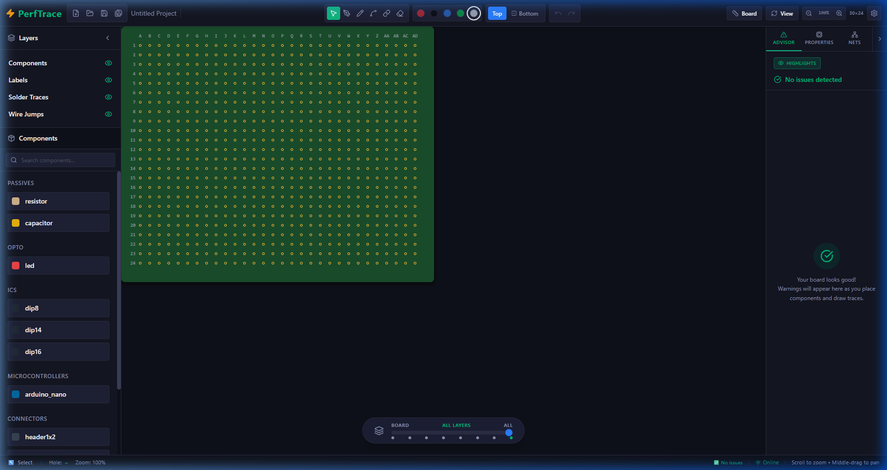
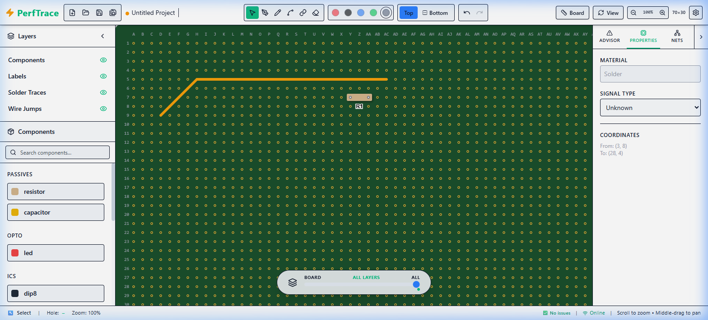

# ⚡ PerfTrace

PerfTrace is a modern, high-performance Perfboard/Stripboard prototyping tool built for electronics enthusiasts and hardware engineers. Design your circuits digitally before you solder them physically.

<div align="center">
  
</div>

## ✨ Features

- **Blazing Fast Canvas:** Built on Konva.js for true 60fps rendering, even with thousands of traces and holes.
- **Trace Advisor Rule Engine:** A real-time engine that detects short circuits, unrouted nets, and polarity mismatches as you draw.
- **Component Library:** Drop in resistors, capacitors, ICs, LEDs, and microcontroller breakouts (like Arduino Nano).
- **Intelligent Routing:** Draw solder bridges, jumper wires, and traces exactly how you would build them in real life.
- **Dual-Sided Editing:** Seamlessly flip between the top (components) and bottom (solder) sides of your board.
- **Adaptive UI:** Beautiful Dark, Light, and System-adaptive themes featuring modern glassmorphism.
- **Local First:** Everything runs directly in your browser. All projects and settings are auto-saved locally using IndexedDB.

<div align="center">
  
</div>

## 🚀 Getting Started

PerfTrace is a frontend application built with React, Vite, and Tailwind CSS v4.

### Prerequisites
- Node.js (v18 or newer)
- npm or pnpm

### Installation

1. Clone the repository:
   ```bash
   git clone https://github.com/your-username/PerfTrace.git
   cd PerfTrace/perftrace-app
   ```

2. Install dependencies:
   ```bash
   npm install
   ```

3. Start the development server:
   ```bash
   npm run dev
   ```

4. Open your browser and navigate to `http://localhost:5173`.

## 🛠️ Tech Stack

- **Framework:** React 19 + TypeScript + Vite
- **Rendering:** Konva.js / React-Konva
- **Styling:** Tailwind CSS v4
- **State Management:** Zustand
- **Icons:** Lucide React

## 📄 License

This project is licensed under the MIT License - see the LICENSE file for details.
